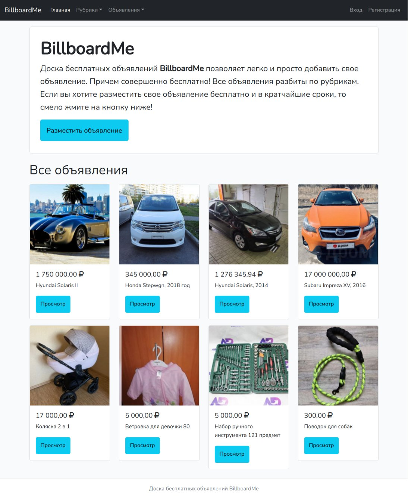

## Пример проекта на Laravel 8

В данном репозитории вы можете ознакомиться с исходниками проекта, написанного на Laravel 8. В качестве JS-фреймворка используется Vue.js. Проект представляет собой вымышленный пример доски объявлений.

### Функционал

1. Авторизация и аутентификация пользователей.

2. Возможность размещать объявления от разных пользователей.

3. Объявления разбиты по рубрикам.

4. Пользователь может видеть отдельный список своих объявлений и список избранных объявлений.

### Использованные дополнения

1. SweetAlert2

2. Intervention Image library для создания превью фотографий на странице объявлений

3. Font Awesome

4. PhotoSwipe для показа фотографий на странице объявлений

5. overtrue/laravel-favorite для реализации функционала избранных объявлений

6. Axios

7. FilePond для удобной загрузки фото на сайт

8. Bootstrap